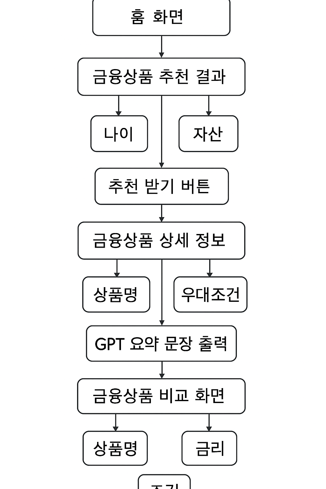
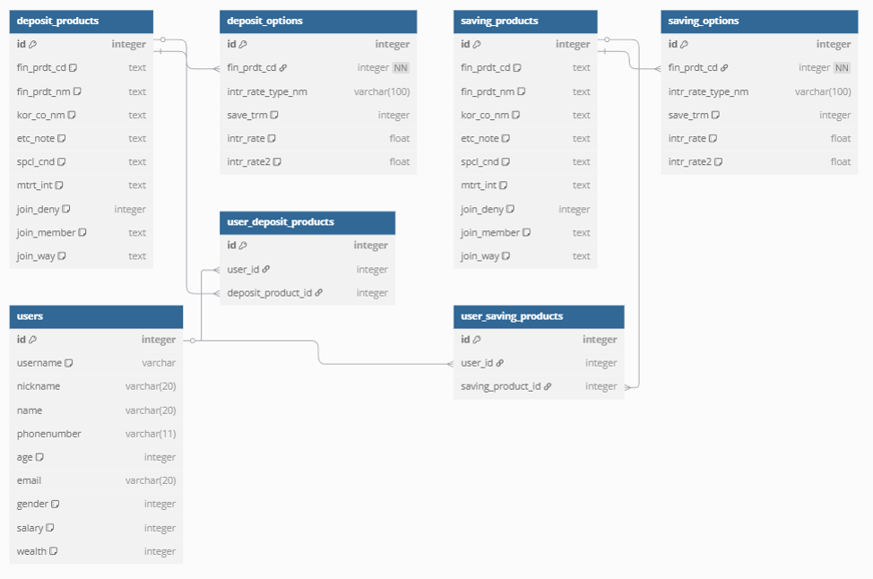

## I. 팀원 정보 및 업무 분담 내역
| 이름 | 역할 | 담당 업무 | 
|------|--------|-----------|
| 김준수 | 팀장 / 백엔드 / 프론트엔드 | 금융상품 비교, 금융상품 소개, 마이페이지, 회원가입, 로그인/아웃, 회원정보 수정
| 윤설아 | 백엔드 / 프론트엔드 | 맞춤형 상품 추천, 환율 정보 조회, 금은시세 조회, 마이페이지, 홈

## II. 설계 내용 (아키텍처 등) 및 실제 구현 정도
### 📄 주요 화면별 기능 설명

| 화면 | 주요 기능 |
|------|-----------|
| 홈 화면 | 서비스 소개, 주요 기능 안내, 각 페이지로 이동할 수 있는 네비게이션 구성 |
| 금융상품 추천 결과 | 사용자 입력(나이, 자산, 목표 등)에 따라 맞춤형 금융상품 추천 결과를 카드 형태로 표시 |
| 금융상품 비교 | 추천된 상품들을 표 형식으로 나열하여 금리, 조건 등을 한눈에 비교 가능 |
| 금융상품 상세 | 개별 상품 클릭 시 상세 정보 출력 및 GPT-4를 통한 핵심 특징 한 줄 요약 제공 |
| 마이페이지 | 사용자가 가입한 예·적금 상품 목록 확인 및 선택 삭제 기능 제공 |
| 은행 검색 | 키워드 기반으로 은행명 검색 가능, 결과에 따라 관련 금융상품 탐색 가능 |
| 프로젝트 소개 | 프로젝트 목적, 팀 구성, 기술 스택 등 브랜딩 중심의 소개 페이지 구성 |
| 회원가입 및 로그인 | 사용자 계정 생성, 로그인, 간단한 유효성 검사 및 인증 흐름 구현 |
| 사용자 정보 관리 | 사용자의 기본 정보(나이, 자산, 성별 등) 확인 및 수정 기능 제공 |
| 금/은 시세 정보 | 실시간 금속 가격(금/은)을 그래프로 시각화, 과거 가격 데이터와 비교 가능 |
| 환율 정보 | 주요 국가 환율 조회 및 미니 차트로 국가별 환율 변동 시각화, 슬라이드 UI 적용 |

## 📊 사용자 흐름 요약 (Financial Flow)


## III. 데이터베이스 모델링 (ERD)


| 테이블명              | 설명                                                                 |
|----------------------|----------------------------------------------------------------------|
| **DepositProducts**  | 예금 상품의 기본 정보를 저장하는 테이블로, 상품명, 은행명, 가입 조건 등을 포함합니다. |
| **DepositOptions**   | 예금 상품의 금리 옵션을 저장하며, 기간별 금리(intr_rate)와 우대금리(intr_rate2)를 포함합니다. |
| **SavingProducts**   | 적금 상품의 기본 정보를 저장하며, 예금과 유사한 구조로 되어 있습니다.               |
| **SavingOptions**    | 적금 상품의 납입 기간 및 금리에 대한 정보를 저장합니다.                            |
| **User**             | 사용자 정보를 저장하는 테이블로, 이름, 나이, 성별, 자산 등의 정보를 포함합니다.     |

각 모델은 실제 금융 데이터 구조와 사용자 데이터를 효과적으로 관리할 수 있도록 설계되어 있으며, 추천 알고리즘과 사용자 인터랙션을 뒷받침하는 핵심적인 역할을 수행합니다.

## IV. 금융 상품 추천 알고리즘에 대한 기술적 설명

본 프로젝트는 사용자의 프로필(나이, 자산 수준, 재무 목표, 예·적금 선호)을 기반으로 맞춤형 금융상품을 추천하는 기능을 제공합니다. 알고리즘은 다음과 같은 순서로 동작합니다.

---

### 🔍 1. 사용자 프로필 입력

사용자는 아래 4가지 정보를 입력합니다:

- **나이(`age`)**: 10대, 20대, 30대, 40대, 50대, 60대 이상
- **자산(`asset`)**: ~300만, ~500만, 1억 이상 등
- **재무 목표(`goal`)**: 생활비, 주택, 노후 준비
- **상품 유형(`type`)**: 예금 or 적금

---

### 🔧 2. 상품 옵션 불러오기

입력된 `type` 값에 따라 다음 모델에서 데이터가 로드됩니다:

- `DepositOptions` (예금 상품)
- `SavingOptions` (적금 상품)

이때 `select_related('fin_prdt_cd')`로 상품 기본 정보와 조인하여 다음 데이터를 수집합니다:

- 상품명, 은행명, 기간(`save_trm`), 최고 우대금리(`intr_rate2`), 기타 정보, 우대 조건 등

---

### 🧠 3. 필터링 로직

사용자 성향에 따라 다단계 필터링을 적용합니다. 모든 조건은 **AND** 조건으로 작동합니다.

#### ✅ 나이에 따른 기간 필터링 이유

| 나이대    | 추천 기준               | 설정 이유 |
|-----------|--------------------------|-----------|
| 10·20대   | 단기 상품 (≤ 12개월)     | 유동성 확보가 중요하며, 목돈이 적고 단기 예치 선호도가 높습니다. 학자금·생활비 목적이 많습니다. |
| 30·40대   | 중기 상품 (12~24개월)    | 결혼·주택 준비 등 중기 자금 운용이 필요한 시기입니다. |
| 50대 이상 | 장기 상품 (≥ 24개월)     | 노후 자산 형성, 안정적 수익 추구를 위한 장기 예치 선호도가 높습니다. |

#### ✅ 재무 목표(goal)에 따른 필터링 이유

| 재무 목표     | 추천 기준                   | 설정 이유 |
|--------------|------------------------------|-----------|
| 생활비        | 단기 상품 (≤ 12개월)         | 자주 인출해야 하므로 유동성이 높은 단기 상품이 적합합니다. |
| 주택          | 장기 상품 (≥ 24개월)         | 장기 계획에 맞춘 자금 준비가 필요합니다. |
| 노후 준비     | 우대금리 3.0% 이상 상품 추천 | 수익률 중심의 자산 운용이 중요합니다. |

#### ✅ 자산 수준(asset)에 따른 필터링 이유

| 자산 수준       | 추천 기준                  | 설정 이유 |
|------------------|-----------------------------|-----------|
| ~300만 / ~500만  | 우대금리 2.0% 이상 추천     | 소액 자산일수록 금리 혜택이 중요한 요소입니다. |
| 1억 이상         | 우대금리 3.5% 이상 추천     | 고자산 보유자는 수익률에 민감하여 더 높은 금리를 선호합니다. |

---

### 🌟 4. 우대금리 기준 상위 추천 상품 추출

- 필터링된 결과를 `intr_rate2` (우대금리) 기준으로 내림차순 정렬
- **중복 상품명을 제거**하여 다양한 상품을 추천
- 상위 3개의 금융 상품을 최종 추천 목록으로 제공합니다

---

### 🧾 5. API 호출 및 응답 예시

- `POST /gpt_recommendation` 요청 시 추천 결과를 반환합니다.

```json
{
  "recommendation": [
    {
      "fin_prdt_cd": "...",
      "fin_prdt_nm": "...",
      "kor_co_nm": "...",
      "save_trm": 12,
      "intr_rate2": 3.2,
      "etc_note": "...",
      "spcl_cnd": "...",
      "join_way": "..."
    },
    ...
  ]
}
```

## V. 서비스 대표 기능들에 대한 설명

본 프로젝트는 사용자 맞춤 금융상품 탐색을 돕는 서비스로, 다음과 같은 주요 기능들을 제공합니다.

---

### 🔍 1. 맞춤형 금융상품 추천

- 사용자 입력(나이, 자산, 목표 등)에 따라 예·적금 상품을 필터링
- 복수 조건(AND) 기반의 맞춤 추천 알고리즘 적용
- 우대금리를 기준으로 상위 3개의 상품을 선별하여 추천
- 추천된 상품은 카드 형태로 시각화되어 직관적으로 확인 가능

---

### 🧠 2. 생성형 AI를 통한 상품 요약

- 각 금융상품의 상세 설명을 GPT-4를 통해 **30자 이내의 한 줄 문장**으로 요약
- 상품의 특징을 한눈에 파악할 수 있어 탐색 시간 단축
- 카드형 UI에 요약 문장이 함께 표시되어 가독성 향상

---

### 📊 3. 금융상품 비교 기능

- 추천된 예·적금 상품을 테이블 형태로 비교
- 금리, 기간, 우대 조건 등을 한눈에 확인 가능
- 사용자의 선택을 돕는 직관적인 비교 경험 제공

---

### 💼 4. 금융상품 상세 정보 제공

- 상품명, 은행명, 금리, 가입 조건 등의 정보를 상세히 제공
- 해당 상품의 GPT 기반 요약 문장도 함께 출력
- 사용자는 상세 내용을 보고 상품을 마이페이지에 저장 가능

---

### 💳 5. 마이페이지 (가입 상품 관리)

- 사용자가 선택한 금융상품을 저장 및 조회 가능
- 가입 취소(삭제) 기능을 통해 관심 상품을 정리할 수 있음
- 사용자 맞춤 금융 포트폴리오 관리 기능 제공

---

### 📈 6. 실시간 금·은 시세 조회

- 금(Gold) 및 은(Silver) 가격을 선 그래프로 시각화
- 주요 금속 가격 변동 추이를 직관적으로 파악 가능
- 투자 목적 사용자를 위한 참고 정보 제공

---

### 🌍 7. 환율 정보 및 미니 차트

- 주요 5개국(USD, JPY, CNY, EUR, GBP)의 실시간 환율 표시
- 환율 변동을 미니 차트로 시각화하여 한눈에 비교 가능
- 스크롤 가능한 슬라이더 UI로 간편하게 확인 가능

---

이러한 기능들을 통해 사용자 맞춤 금융상품 탐색을 돕는 동시에, 데이터 기반 탐색과 생성형 AI의 융합을 통해 차별화된 경험을 제공합니다.

## VI. 생성형 AI를 활용한 부분

본 프로젝트에서는 OpenAI의 GPT 모델(GPT-4)을 활용하여 사용자 맞춤형 금융 정보 제공을 구현하였습니다.  
생성형 AI는 다음과 같은 두 가지 핵심 기능에 적용되었습니다.

---

### 🧠 1. 맞춤형 금융상품 추천

사용자의 나이, 자산 수준, 재무 목표, 선호 상품 유형(예금/적금) 등 프로필 정보를 입력받아, 조건 기반 필터링 후 **우대금리(intr_rate2)**를 기준으로 상위 3개의 금융상품을 추천합니다.  
추천 알고리즘은 사전에 정의된 규칙 기반 필터링으로 작동하며, GPT API와 직접 연결되지는 않지만, **향후 자연어 기반 질의 추천으로 확장 가능**하도록 설계되었습니다.

---

### ✏️ 2. 금융상품 정보 요약 (한 줄 소개 생성)

금융상품 상세 설명이 길고 복잡해 사용자들이 빠르게 이해하기 어려운 문제를 해결하기 위해, GPT-4를 활용하여 **상품 특징을 요약하는 기능**을 도입했습니다.  
해당 기능은 상품의 설명 필드를 기반으로 **30자 이내의 한 문장 요약**을 생성하여, 사용자가 **간결하게 상품의 핵심을 파악**할 수 있도록 돕습니다.

#### ✅ 기능 개요

- **적용 대상**: 예금(`DepositProducts`) 및 적금(`SavingProducts`) 상품
- **입력 데이터**:
  - `etc_note`: 기타 설명  
  - `spcl_cnd`: 우대 조건  
  - `join_member`: 가입 대상  
  - `join_way`: 가입 방법
- **출력 형식**: 핵심 기능 또는 장점을 요약한 **30자 이내 한 문장**

#### 🧾 GPT 프롬프트 구성 예시

```text
당신은 금융상품 소개를 위한 마케팅 문구를 작성하는 요약 전문가입니다.
아래 예금 상품 정보를 바탕으로 **은행명과 상품명을 제외한**, 핵심 특징을 **30자 이내 한 문장**으로 요약해 주세요.

--- 예금 상품 설명 ---
기타 설명: {etc_note}
우대 조건: {spcl_cnd}
가입 대상: {join_member}
가입 방법: {join_way}
-----------------------

한 줄 요약 (30자 이내):
```

## VII. 느낀점 및 후기

이번 프로젝트는 단순한 웹 서비스 구현을 넘어, **생성형 AI를 실질적인 사용자 경험에 적용**해 본 뜻깊은 경험이었습니다.

처음에는 금융 데이터를 사용자에게 어떻게 효과적으로 전달할지에 대한 고민이 많았지만, GPT-4를 활용해 상품 설명을 간결하게 요약하는 기능을 도입함으로써 **정보 전달의 복잡성을 줄이고 가독성을 높이는 성과**를 얻을 수 있었습니다.  
또한, 사용자 입력에 따른 추천 로직을 직접 설계하면서 **데이터 기반 조건 필터링의 중요성**과 **서비스 기획과 구현 간의 균형감각**을 체득할 수 있었습니다.

프론트엔드와 백엔드를 명확히 분리하여 협업한 덕분에, 각자의 역할에 집중하면서도 통합적인 품질을 유지할 수 있었고, 실제 사용자 입장에서의 흐름(탐색 → 추천 → 상세 → 비교 → 저장)을 설계하면서 **UX 중심 사고**의 중요성도 체감했습니다.

---

### 👥 팀 프로젝트에서 얻은 점

- Git, 협업 툴을 활용한 실시간 소통 및 버전 관리
- 역할 분담과 동시에 지속적인 코드 리뷰를 통한 품질 향상
- 정기 회의를 통해 빠르게 피드백을 반영하고 방향성을 조정하는 팀워크 경험

---

### 💡 앞으로의 확장 가능성

- GPT를 활용한 **챗봇 기반 금융 상담** 기능 확장
- 추천 로직의 **머신러닝 기반 자동화**
- 사용자 맞춤 상품 알림 서비스 등 **개인화 기능 고도화**

---

이번 프로젝트를 통해 **기술과 사용자 중심 기획의 조화가 왜 중요한지를 몸소 체감**할 수 있었으며, 앞으로도 생성형 AI와 데이터 기술을 적극적으로 활용해 실질적인 가치를 제공하는 서비스를 만들고 싶다는 확신을 얻었습니다.

